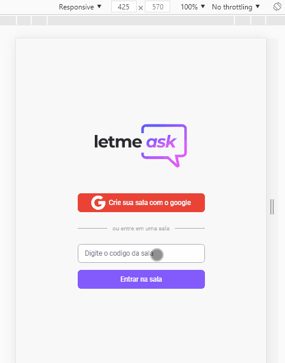

# Letmeask

</img>

  </img>
  
 Versao mobile

# Informaçoes:

## Aplicaçao letmeask:

- Aplicaçao tem finalidade de perguntas e resposta em tempo real, isso é um usuario autenticado pode criar uma sala, enviar o codigo da sala para outros usuarios entrarem na mesma sala que ele e fazer perguntas.
- O publico alvo dessa aplicaçao é para criadores de conteudos digitais, que quando estiverem fazendo uma live, responde seus telespectadores de uma forma mais organizada como a aplicaçao ofereçe.

## Regras de autorizaçao:

- Usuarios autenticados:
  - Pode cria sala.
  - Envia perguntas.
  - Marca como gostei.
  - Usuario criador da sala pode da destaque na pergunta, marca como respondida, excui pergunta e encerra a sala.
- Usuario nao autenticado:
  - Pode entra na sala com o codigo.
  - Ler e acompanha sem nenhuma interaçao direta.

## React:

- Utilizando a metodologia de contextos para compartilhar informaçoes em diferentes componentes.
- Hooks customizados para reaproveitar logica em diferentes paginas.
- Navegaçao usando api do react-router-dom.

## Integraçao com Firebase:

- Autenticaçao de usuarios, usando conta do google.
- Usando regras do firebase para autorizaçoes de usuarios.
- Usando banco de dados Realtime database, para guarda dados e perguntas dos usuarios e requisita quando necessario.

  

# Tecnologias:

- Html5
- Css3
- JavaScript
- React
  - react-router-dom
- Firebase
  - Authentication
  - Realtime Database
  

## Style:

<pre>
  --background: #e5e5e5;
  --white-details: #fefefe;
  --white: #f8f8f8;
  --black: #29292e;
  --shadow: #050206;
  --denger: #e73f5d;
  --purple: #835afd;

  --pink-dark: #e559f9;
  --pink-light: #d67ee2;

  --grey-dark: #737380;
  --grey-medium: #a8a8b3;
  --grey-light: #dbdcdd;

  font-size: 62.5%;
</pre>

## Considerações:

<pre>
    Aplicaçao desenvolvida junto a NLW da <a href='https://rocketseat.com.br/'>Rocketseat</a>.
</pre>
